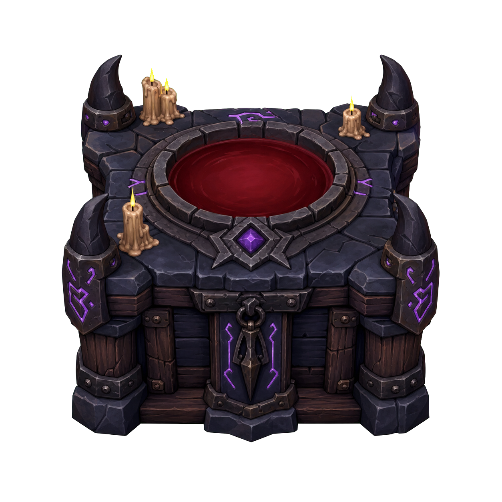

# Mind Over Magic Mods

Four independent BepInEx 5 plugins for **Mind Over Magic**: character-level
relic caps, a focused faction rebalance, a fully playable Sacrificial Altar,
and an independently authored late-game magic progression module.



These are unofficial, fan-made mods. They are not affiliated with or supported
by Sparkypants Studios or Klei Entertainment.

## Modules

| Module | Version | What it changes |
| --- | ---: | --- |
| Character Level Relics | 1.1.0 | Bases manifested relic level caps on the mage's level and completed trials instead of wand tier. |
| Faction Balance | 1.0.0 | Reduces the Raven Cult's universal advantages and gives the Shattered the strongest Power growth. |
| Sacrificial Altar | 1.3.7 | Adds a buildable altar, dedicated Sacrificial Rites research, sacrificial relic-upgrade ritual, Dark Temple room, custom model, and room treatment. |
| Archmage Progression | 0.2.1 | Per-skill bonuses, Adept and Archmage ranks with powers, and a school-wide Archmage Council, without editing base-game files. |

The modules do not depend on one another. Install any combination of them.

## Modding documentation

The [Practical Mind Over Magic Modding Guide](docs/MODDING-GUIDE.md) collects
the implementation patterns, debugging lessons, failure modes, testing
checklists, packaging practices, and save-safety guidance learned while
developing these mods.

## Requirements

- Mind Over Magic for Windows on Steam
- [BepInEx 5.4.23.5](https://github.com/BepInEx/BepInEx/releases)
  for Windows x64
- The release was built and tested against Mind Over Magic Steam build
  `20147148`

Game updates can change internal methods or data definitions and may require a
new version of these plugins.

## Installation

1. Install BepInEx 5 into the Mind Over Magic directory. This is the directory
   containing `mindovermagic.exe`.
2. Start the game once and close it, allowing BepInEx to create its folders.
3. Download either the **All Modules** ZIP or just the individual module ZIPs
   you want from the latest GitHub release. Each ZIP is independently
   extractable.
4. Extract every chosen ZIP into the Mind Over Magic directory. Merge the included
   `BepInEx` folder when prompted.
5. Start the game normally through Steam.

The release asset names are:

| Asset | Contents |
| --- | --- |
| `MindOverMagic-Mods-v<version>.zip` | All modules (convenience option) |
| `MindOverMagic-CharacterLevelRelics-v<version>.zip` | Character Level Relics only |
| `MindOverMagic-FactionBalance-v<version>.zip` | Faction Balance only |
| `MindOverMagic-SacrificialAltar-v<version>.zip` | Sacrificial Altar only |
| `MindOverMagic-ArchmageProgression-v<version>.zip` | Archmage Progression only |

The resulting layout is:

```text
MindOverMagic/
└── BepInEx/
    └── plugins/
        ├── CharacterLevelRelics/
        │   └── CharacterLevelRelics.dll
        ├── FactionBalance/
        │   └── FactionBalance.dll
        └── SacrificialAltar/
            ├── SacrificialAltar.dll
            └── Content/
                ├── CharacterStatus/
                ├── Entities/
                ├── RoomTypes/
                └── Wallpaper/
        └── ArchmageProgression/
            ├── ArchmageProgression.dll
            └── Content/
                └── CharacterStatus/
```

On a successful launch, `BepInEx\LogOutput.log` contains a `loaded` line for
each installed module.

## Character Level Relics

Relics manifested from mages use this formula:

```text
level cap = min(24, mage level + completed trial bonuses)
```

Every earned trial contributes independently:

| Modifier | Base game | With this module |
| --- | ---: | ---: |
| Wand Tier I base | 5 | 0 |
| Wand Tier II | +4 | 0 |
| Wand Tier III | +4 | 0 |
| Each tier 0 or tier 1 trial | +1 | +1 |
| Each tier 2 trial | +2 | +2 |
| Each tier 3 trial | +3 | +3 |
| Completed apprenticeship | +3 | 0 |
| Mage's current level | 0 | +1 per level |
| Maximum manifested cap | 24 | 24 |

Additional behavior:

- A mage can contribute up to 18 levels from character level.
- Wand type and wand tier no longer affect the result.
- The apprenticeship bonus is removed.
- Relic sources without a character level fall back to the original game
  calculation.
- Existing relics and their accumulated XP are not retroactively changed.

## Faction Balance

This module keeps Raven Cultists strong and flexible while making a full school
of Raven Cultists less automatically optimal.

| Change | Base game | Modded default |
| --- | ---: | ---: |
| Raven Cult Power growth | S | A |
| Shattered Power growth | A | S |
| Raven Cult faction-trait base HP | 150 | 125 |
| Raven Cult faction-trait damage bonus | 20 | 10 |

Other faction values are unchanged. Raven Cult HP and damage values can be
edited after the first launch in:

```text
BepInEx\config\ca.johnc.mindovermagic.factionbalance.cfg
```

Changes to that configuration require a game restart.

## Sacrificial Altar

The Sacrificial Altar is unlocked by the dedicated **Sacrificial Rites** Tier III
research topic. Sacrificial Rites requires **Dark Arts**, costs 3,000 research,
and makes the altar available under **Furniture > Rituals & Relics** when
completed.

### Construction

- 20 Stone
- 5 Viscera
- 5 Small Carcasses
- 48 construction casts

The altar uses an original procedural Unity model assembled by the plugin at
runtime. No game prefab or external asset bundle is redistributed.

### Sacrifice for Relic ritual

The ritual takes three in-game hours. Select one relic and one living mage:

| Sacrifice | Relic level-cap increase |
| --- | ---: |
| Student | +1 |
| Apprentice | +2 |
| Staff | +3 |
| Ritual performed in a Dark Temple | Additional +1 |

The relic is a ritual target, not an ingredient. After completion it retains
its identity and XP, receives the available cap increase through the game's
native relic-upgrade routine, and is released beside the altar.

The sacrificed mage dies and leaves a corpse that must be buried. Every mage
in the school receives **Sacrificed Mage**, a -10 Conviction penalty lasting
48 in-game hours.

### Dark Temple

A room qualifies as a Dark Temple when it contains:

- At least 1 Sacrificial Altar
- At least 2 Candelabras
- At least 20 Creepy luxury
- No beds
- No dining tables
- No teaching stations

Sacrifices performed there gain the additional +1 relic-cap bonus. Qualifying
rooms automatically receive the game's dark occult classroom-style walls,
backwall, floor, and hallway treatment.

## Archmage Progression (early access)

Archmage Progression is an independent, source-available interpretation of
late-game magic-school advancement. It does not reuse another mod's files,
assembly, assets, or code, and it never writes to Mind Over Magic's YAML files.

Every point in a magic school provides a configurable benefit. The game shows
the schools by element, given in brackets:

| School | Per-skill benefit | Default |
| --- | --- | ---: |
| Pyromancy (Fire) | Maximum Mana | +5 |
| Geomancy (Earth) | Maximum HP | +5 |
| Divination (Lightning) | Combat Damage Bonus | +2 |
| Manipulation (Air) | Combat Dodge Chance | +2 |
| Hydrokinesis (Water) | Combat regeneration | +1 |
| Necromancy (Dark) | Slower ordinary need decay | 2% |
| Viturgy (Nature) | Conviction target | +2 |

Viturgy's bonus is a native status named "Viturgy Attunement". It appears in the
mage's Status & Conviction panel with its exact value, alongside the game's own
Conviction modifiers.

### Stat breakdown

The game's own stat hover text lists each school's contribution, in the same
style the game uses for traits and statuses:

- **Selected-mage panel:** hovering the HP or Mana bar shows a line such as
  "Earth 8 (Archmage Progression): +40".
- **Mage Sheet:** hovering the Max HP, Max Mana or Damage Bonus icon in the
  LEVEL section shows the same kind of line.
- **Status & Conviction panel:** Viturgy Attunement is listed with the other
  Conviction modifiers.

Combat regeneration and need decay have no stat hover in the game, so those two
are described in the Water and Dark rank tooltips instead. Set `Enabled = false`
under `Stat breakdown` in the config to turn the hover lines off.

### School ranks

Version 0.2.0 adds a visible progression ladder. For each school, a mage earns
a rank status once their trained skill level reaches the configured threshold:

| Rank | Default skill level | Status shown on the mage |
| --- | ---: | --- |
| Adept | 5 | `<School> Adept`, for example "Pyromancy Adept" |
| Archmage | 8 (the base-game cap) | `Archmage of <School>` |

Every school has ranks, including Viturgy (shown in game as Nature). A mage holds at most one rank per school, so up to seven badges in total. Select
a mage and the ranks are listed in the short status summary under the portrait,
alongside lines like their Conviction level. Hovering one shows the rank threshold plus the exact per-level and minimum bonus
the plugin grants for that school, generated from this install's config values
so the tooltip never disagrees with the numbers in play. Earning a rank writes
"<mage> earned the title of <rank>" to the log book.

The per-skill bonuses above are granted from level 1 regardless of rank, and
they still apply if badges are disabled. Ranks are checked the moment a trained skill level changes and again on the game's
regular student status sweep, so existing saves gain their badges a few seconds
after the game is unpaused. Nothing appears while the game stays paused. Gear and temporary skill bonuses do not count toward a rank.

### Rank powers

Some ranks also grant a power. An Archmage keeps the school's Adept power. Each
power is listed in the rank's tooltip and can be tuned or switched off in the
config.

| School | Adept power (level 5) | Archmage power (level 8) |
| --- | --- | --- |
| Manipulation (Air) | Walks twice as fast | Also flies and passes through walls and floors |
| Pyromancy (Fire) | Cooks twice as fast; starts every battle with Counterattack for two rounds | Also, once a day, burns away one of their own traumas or scars and is Renewed by Flame (+10 Conviction target for a day) |
| Geomancy (Earth) | Starts every battle with armour equal to 50% of Max HP | Also immune to harmful combat effects; while the school has one, it can build Nexus Gateways |
| Hydrokinesis (Water) | Sheds harmful combat effects at the start of every round | Also, while the school has one, it can build the Waters of Return fountain |
| Divination (Lightning) | Starts every battle standing on a mana vein | Also casts every spell without spending mana, in battle or at school |
| Necromancy (Dark) | Regains 10% of spell damage dealt as HP, and 25 HP whenever a foe falls | Also, ordinary needs no longer decay, and at midnight and noon gathers 5 of a random dark reagent |
| Viturgy (Nature) | Every room gains +2 Luxury while the school has one; does not stack | Also +5 Conviction target to every other mage |

"Harmful combat effects" uses the game's own definition: the non-beneficial
effects that the Sanctified battle terrain cleanses, such as Stunned, Blinded,
Burns, Fear, Soaked and Jolted. Ranks, fleeing, injuries and knock-outs are
never touched. Earth armour reuses the game's "Girded for Battle" mechanism,
and Dark's heal on a fallen foe is the game's own heal-on-enemy-death effect.

The Lightning mana vein is a real battle-terrain vein placed on the mage's
starting slot, so it halves spell costs only while they stay on it. The Nexus
Gateway is a buildable copy of the Underschool's teleporting gateway, found
under Furniture > School Traversal. Built gateways teleport to one another and
to any Underschool gateways the school has discovered. Gateways already built
keep working if the school later loses its Earth Archmage. Dark reagent
bounties arrive at the school entrance for haulers to put away; the reagent list
is configurable.

Flight and the Fire powers reuse the game's own effects: the legacy "Ghostly
Movement" pathing, the cooking-speed modifier, and the battle-start Counterattack
granted by "Hour of the Raven Cult". An Archmage of Air walks rather than plays
the flying animation while phasing.

Each Archmage of Viturgy adds an "Embrace of Nature" status to every other mage,
listed in the Status & Conviction panel.

### Archmage Council

The school's Archmage ranks are counted together. A mage who is an Archmage in
two schools counts twice. Council powers apply to every mage once the school
holds enough:

| Archmage ranks | Power | Effect |
| ---: | --- | --- |
| 1 | Rematch Spoils | Boss rematches pay what the first victory paid, relic included |
| 1+ | Swift Travel | Each Archmage rank cuts remaining quest travel by a tenth; at 10, parties return at once |
| 2 | Refining | The Earth, Air, Fire and Dark refineries hand back twice what they make |
| 3 | Resolve | +10 Conviction target for every mage |
| 4 | Open Ledgers | Scouting a faction reveals every side quest, not just two |
| 5 | Scholarship | Teaching and learning are twice as fast |
| 6 | Mending | Wounds (trauma injuries) close three times as fast |
| 7 | Steady Minds | A mental break no longer leaves the mage At Death's Door |

Steady Minds still grants the post-break Conviction recovery the game gives a
broken mage on revival. It skips the revival trauma, because there is no
knock-out to revive from.

The school's founder, its ghost mage, carries an "Archmage Council (N)" badge.
Hovering it lists the powers in force and the ones still to unlock. Resolve
appears in each mage's Status & Conviction panel. Scholarship uses the same
fields as the game's classroom and teacher bonuses.

All of these definitions ship as plugin-owned YAML in the `Content` folder
beside the DLL, generated by `scripts/generate_archmage_content.py`. If that
folder is missing, the plugin logs a warning and shows no badges, powers or
school-wide effects; the per-skill bonuses still apply.

### Not yet implemented

### Waters of Return

While the school has an Archmage of Water, the Waters of Return fountain
appears under Furniture > Rituals and Relics. It uses the Water Apprentice
Fountain's model. Its ritual needs an Archmage of Water as officiant and costs
1 Mana Crystal, 50 Phoenix Flowers and 54 Gnosis Shards. It raises the mage
buried in a grave **in the same room** as the fountain, so build both inside a
walled room; a grave outdoors never counts.

The ritual button stays disabled, with the reason in its tooltip, until a
raisable mage lies in a grave in that room. That way the ingredients are never
spent on a mage who cannot return. The founder, a ghost who serves as staff,
and mages who graduated, retired or were expelled before dying cannot be
raised.

The base game has no working resurrection, so the revival rebuilds the mage the
way the game creates students and staff. The mage keeps their name,
appearance, level, skills, role and wand type. These do not come back:

- badges and badge progress, likes, relationships and any statuses they had;
- stat-growth offsets and relic-slot layout, which are rolled again;
- bed, desk and group assignments, and equipped relics, which must be set again;
- the mourning and student-death penalties other mages received.

The revival runs a moment after the ritual ends. The log book records it, or,
if something prevents it, records why.

Swift Travel shortens quests already under way, but a quest's planned duration
shown before it starts is the normal one. Those require separate validated game hooks and will be released only
when each can be tested without save-file edits or base-file replacement.

### Configuration

After its first launch, adjust the values in:

```text
BepInEx/config/ca.johnc.mindovermagic.archmageprogression.cfg
```

The `Rank statuses` section holds an on/off switch and the two rank thresholds.
`Rank powers` tunes or disables each power, and `Archmage Council` sets each
Council power's threshold and strength.
Setting a threshold to 0 disables that rank. `Conviction per Viturgy` set to 0
disables the Viturgy bonus. The `Stat breakdown` section turns the hover lines
on or off. Restart the game after changing
any value.

## Updating

Close the game, extract the new release over the old files, and allow existing
files to be replaced. Do not leave multiple copies of the same plugin DLL in
different BepInEx subdirectories.

## Uninstalling and saves

`CharacterLevelRelics` and `FactionBalance` can be removed by deleting their
plugin folders while the game is closed.

Demolish any Nexus Gateways and Waters of Return fountains before removing
`ArchmageProgression`; like the Sacrificial Altar, they are mod-defined
buildings in the save. Mages raised by the fountain stay ordinary mages after
uninstalling.

`ArchmageProgression` rank and Viturgy Attunement statuses are saved with each
mage. Before removing the plugin, set `Enabled = false` under `Rank statuses`
and `Conviction per Viturgy = 0` in its config file,
load each school once, and save; the next status sweep strips every badge so no
save references the plugin's statuses afterward. Keep the old save as a backup.

`SacrificialAltar` adds custom definitions that can be referenced by saved
schools. Back up your saves before installing it. Before removing it, demolish
all Sacrificial Altars, allow any Sacrificed Mage status effects to expire, save
under a new name, and keep the old save as a backup. Removing a content mod from
a save that still references its custom entities can prevent the save from
loading correctly.

## Troubleshooting

- Confirm that `BepInEx\LogOutput.log` exists. If not, BepInEx itself is not
  installed or loading.
- Confirm that the plugin DLLs are under `BepInEx\plugins`, not beside the game
  executable and not inside an extra nested ZIP folder.
- Search `LogOutput.log` for `Character Level Relics`, `Faction Balance`,
  `Sacrificial Altar`, or `Archmage Progression`.
- If rank badges never appear, confirm the file `BepInEx\plugins\ArchmageProgression\Content\CharacterStatus\archmage_ranks.yaml`
  exists and look for an `Injected 92 Archmage Progression statuses` line in the log.
- The altar will not appear in the build menu until Sacrificial Rites has been
  completed in that school.
- Back up affected saves and report the game build, mod versions, and relevant
  BepInEx log lines with any bug report.

## Building from source

Install BepInEx into Mind Over Magic, then run:

```powershell
dotnet build src\CharacterLevelRelics\CharacterLevelRelics.csproj -c Release
dotnet build src\FactionBalance\FactionBalance.csproj -c Release
dotnet build src\SacrificialAltar\SacrificialAltar.csproj -c Release
dotnet build src\ArchmageAscension\ArchmageAscension.csproj -c Release
```

The projects assume Steam's default install location. Override it when needed:

```powershell
dotnet build src\SacrificialAltar\SacrificialAltar.csproj -c Release `
  -p:GameDir="D:\SteamLibrary\steamapps\common\MindOverMagic"
```

Run `scripts\package.ps1` to build all modules and create the distributable ZIP
under `dist`.

## License and permissions

The original source code and original altar artwork in this repository are
released under the [MIT License](LICENSE). Mind Over Magic, its code, assets,
names, and trademarks belong to their respective owners and are not covered by
this repository's license.

Do not redistribute Mind Over Magic assemblies with these mods. This project
references locally installed game assemblies only at build time.
